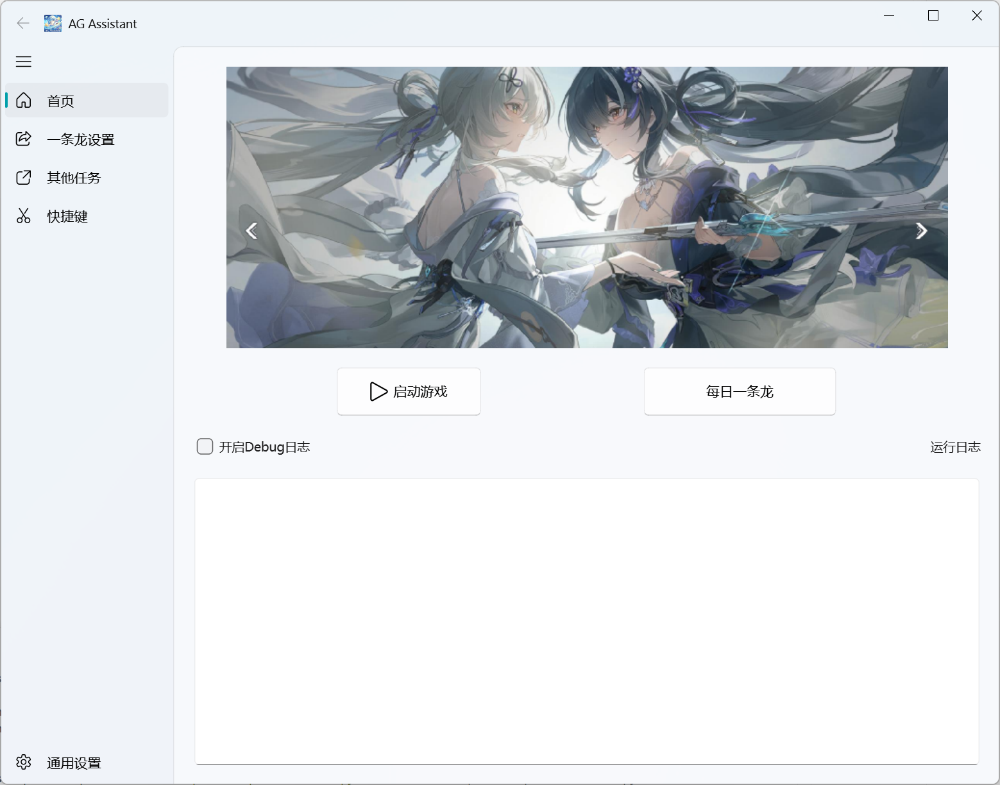
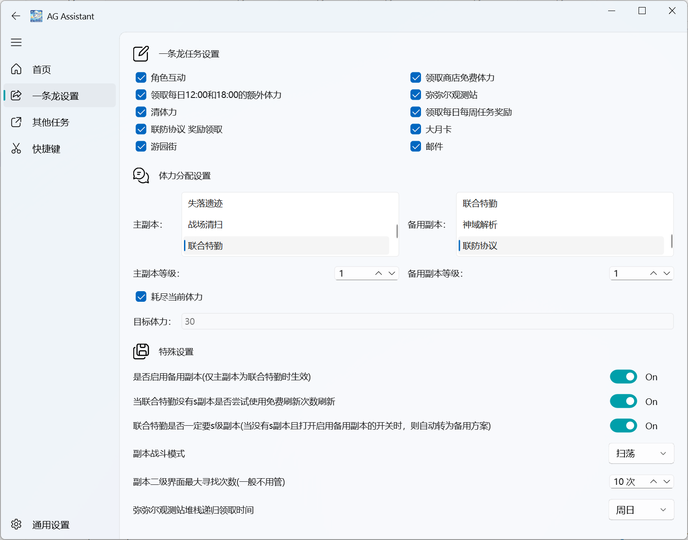
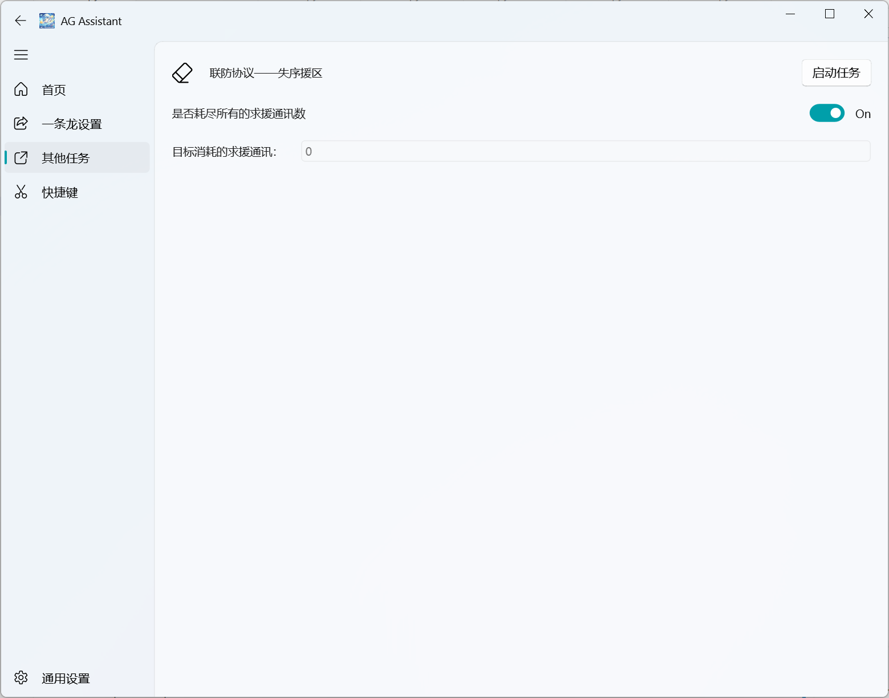
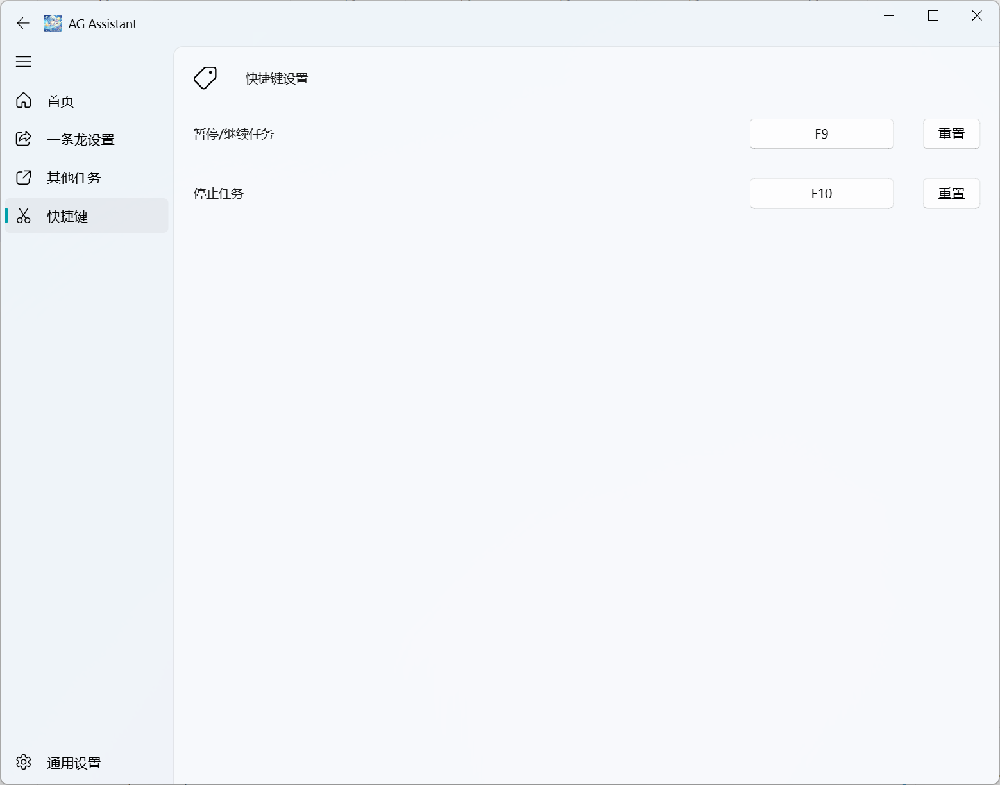
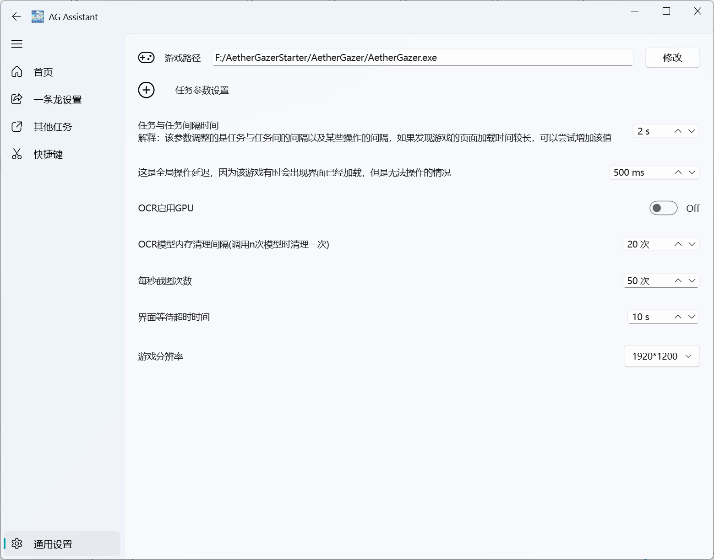

# AG Assistant是基于计算机视觉的AetherGazer游戏助手

这是本人的第一个比较大的项目，全程由个人开发完成，因为是第一个项目，因此一定有诸多不足，如遇bug，可在github上提交issues，或在b站私信我【小钟QW的个人空间-哔哩哔哩】 https://b23.tv/mPoELRg

## 目前支持的功能

1. **每日一条龙**

支持自定义每日一条龙的项目

2. **支持自定义扫荡副本**

联合特勤已进行特别优化，按S＞A＞B的优先级刷取副本，可选择是否必须刷取S副本，是否使用免费次数刷新，是否在无S副本时刷取备用副本。

3. **新增支持联防协议--失序援区的刷取**

4. **支持暂停任务/停止任务，支持快捷键自定义**

5. **可设置项**

## 待更新项目

1. 指定购买每周四刷新的商店碎片和每日的商店碎片

2. 自动战斗以及自动模拟宇宙等
